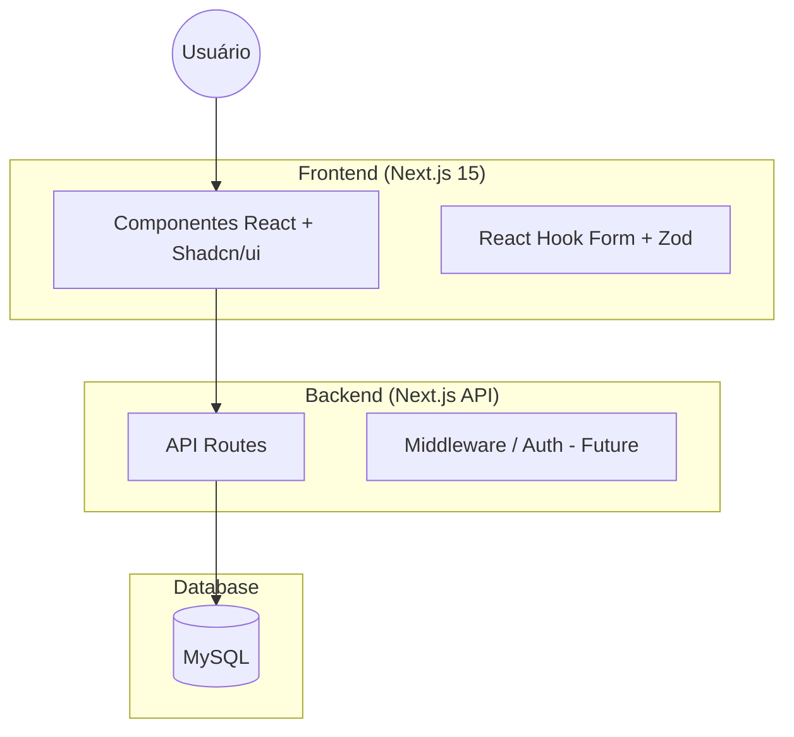

# 📖 Meu Livro de Receitas

Uma plataforma moderna e intuitiva para organizar, descobrir e gerenciar suas receitas culinárias favoritas.

---

## 🎯 Objetivo + Problema

### O Problema
Muitas pessoas perdem suas receitas favoritas em anotações físicas, aplicativos de mensagens ou sites variados. Não existe uma forma centralizada, fácil de buscar e visualmente agradável de manter um acervo culinário pessoal que seja acessível tanto em desktop quanto em dispositivos móveis.

### O Objetivo
Prover uma aplicação web de alta performance que permita ao usuário centralizar suas receitas, facilitando a busca por ingredientes, categorias ou tags, além de oferecer uma experiência visual premium com suporte a temas e favoritos.

---

## 🏗️ Arquitetura

A aplicação segue uma arquitetura moderna de Fullstack Next.js, utilizando o App Router para roteamento e Server Actions/API Routes para comunicação com o banco de dados.



### Stack Tecnológica
- **Framework:** Next.js 15 (App Router)
- **Linguagem:** TypeScript
- **Estilização:** Tailwind CSS + Shadcn/UI
- **Banco de Dados:** MySQL
- **Testes:** Vitest + React Testing Library
- **Containerização:** Docker + Docker Compose
- **CI/CD:** GitHub Actions

---

## 🚀 Como Rodar

### Ambiente de Desenvolvimento (Local)

1. **Pré-requisitos:** Node.js 20+, MySQL (ou XAMPP).
2. **Instalação:**
   ```bash
   npm install --legacy-peer-deps
   ```
3. **Configuração:** Crie um arquivo `.env.local`:
   ```env
   DB_HOST=localhost
   DB_USER=root
   DB_PASSWORD=
   DB_NAME=livro_receitas
   ```
4. **Execução:**
   ```bash
   npm run dev
   ```

### Ambiente de Produção

1. **Build:**
   ```bash
   npm run build
   ```
2. **Start:**
   ```bash
   npm start
   ```

---

## 🐳 Docker

Para rodar o projeto completo (App + Banco) de forma isolada:

```bash
docker-compose up -d
```
A aplicação estará disponível em `http://localhost:3000` e o MySQL em `localhost:3306`.

---

## 🧪 Testes

O projeto conta com uma suíte de testes unitários e de componentes utilizando Vitest.

```bash
# Rodar todos os testes
npm test

# Rodar em modo watch
npm run test:watch
```

**Cobertura atual:**
- Testes de utilitários (`cn` helper).
- Testes de componentes core (`RecipeCard`).
- Verificação de renderização e lógica de exibição.

---

## ⚙️ GitHub Actions

Pipeline de CI configurada para garantir a qualidade em cada commit:
- **Linting:** Verifica padrões de código.
- **Build test:** Garante que a aplicação compila corretamente.
- **Unit Tests:** Executa a suíte de testes automaticamente.

Veja o status em: `.github/workflows/ci.yml`

---

## 🔌 Exemplos de Request/Response (API)

### Listar Receitas
`GET /api/recipes`

**Response (200 OK):**
```json
[
  {
    "id": "1",
    "title": "Bolo de Cenoura",
    "category": "Sobremesas",
    "prepTime": "20min",
    "rating": 4.5
  }
]
```

### Criar Receita
`POST /api/recipes`

**Request:**
```json
{
  "title": "Nhoque de Batata",
  "category": "Pratos Principais",
  "ingredients": ["1kg batata", "200g farinha"]
}
```

---

## 📸 Interface (UI)

A aplicação possui uma interface moderna e responsiva.

| Desktop View | Mobile View |
|--------------|-------------|
|  |  |

---

## 🤖 Créditos

Este projeto foi desenvolvido com o auxílio estratégico de **Inteligência Artificial (IA)** para o aumento de produtividade, refatoração de código e implementação de infraestrutura de testes.

---
Desenvolvido por Ralf.
